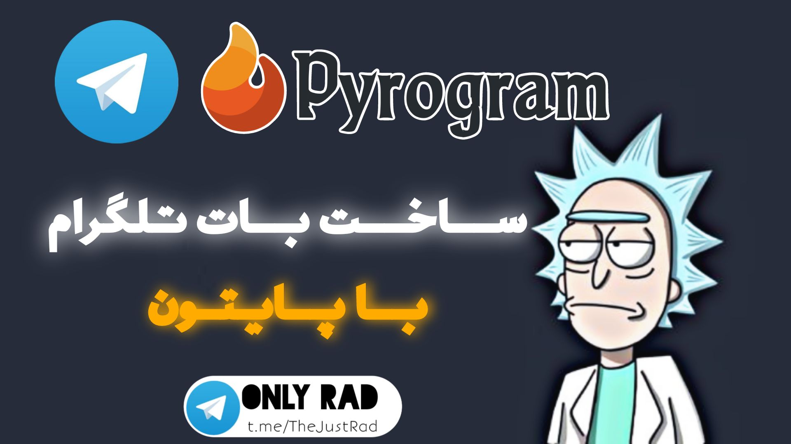

# <a href="https://github.com/OnlyRad/Telegram">Telegram</a>

<a href="https:t.me/TheCommit">Telegram Channel</a> | <a href="https://github.com/OnlyRad">GitHub</a> | <a href="https:rubika.ir/TheLinux">Rubika Channel</a> | 
<a href="https:youtube.com/OnlyCommit">YouTube</a>
<h3 align="center">آموزش نصب کتابخانه و استارت</h3>

```python
pip install pyrogram
```

```python
from pyrogram import Client
app = Client(
    "Name",
    "API-ID",
    "API-Hash",
    "Bot-Token"
)
```
<h3 align="center">سینتکس ارسال پیام</h3>

```python
@app.on_handler()
async def start(client , message):
    await app.send_message(message.chat.id , "متن پیامتون")
if __name__ == '__main__':
    app.run()
```

<h4>ادامه ی آموزش متد ها در قسمت issue هستند</h4>
<h5>حتما نگاه کنید چون اونجا به طور کامل متد هارو توضیح میدیم و خیلی ساده میتونید باهاشون کار کنید</h5>
<h4 align="right">ادامه ی آموزش متد ها در قسمت issue هستند</h4>
<h5 align="right">حتما نگاه کنید چون اونجا به طور کامل متد هارو توضیح میدیم و خیلی ساده میتونید باهاشون کار کنید</h5>


<hr>
<a href="https:t.me/TheCommit">Telegram</a> | <a href="https://github.com/OnlyRad">GitHub</a> | <a href="https:rubika.ir/TheLinux">Rubika Channel</a> | 
<a href="https:youtube.com/OnlyCommit">YouTube</a>
